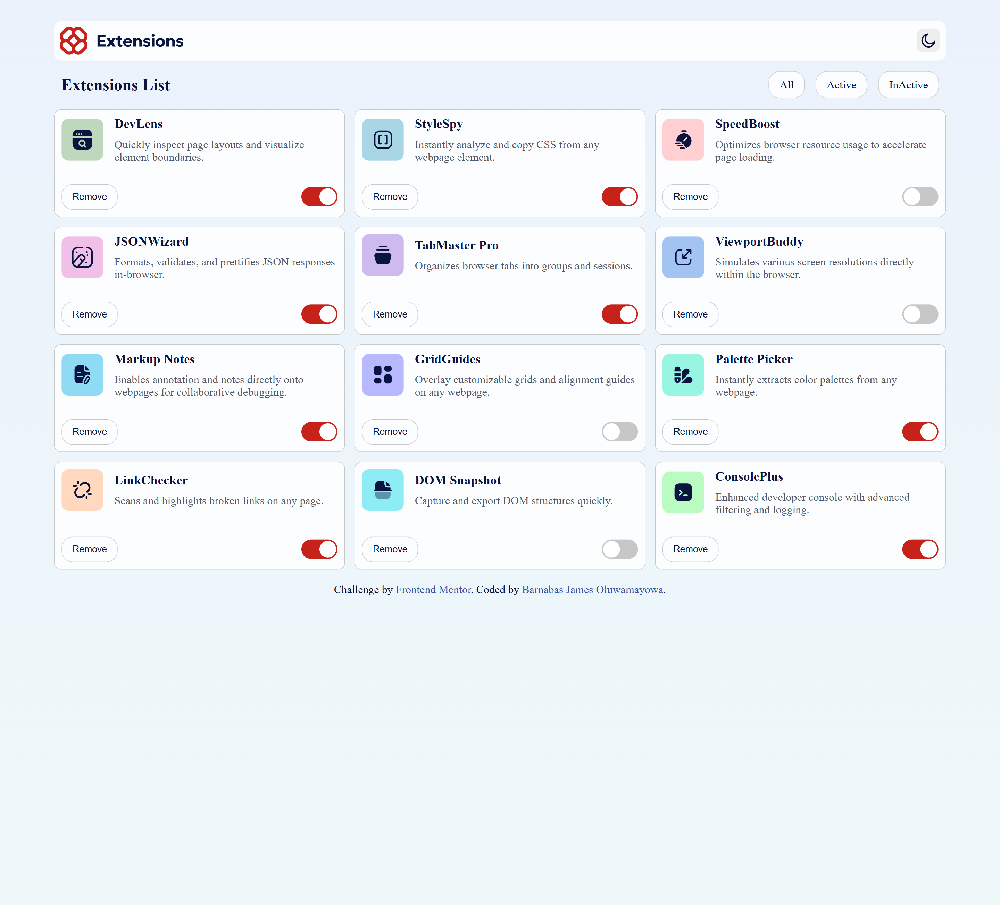

# Frontend Mentor - Browser extensions manager UI solution

This is a solution to the [Browser extensions manager UI challenge on Frontend Mentor](https://www.frontendmentor.io/challenges/browser-extension-manager-ui-yNZnOfsMAp). Frontend Mentor challenges help you improve your coding skills by building realistic projects.

## Table of contents

- [Overview](#overview)
  - [The challenge](#the-challenge)
  - [Screenshot](#screenshot)
  - [Links](#links)
- [My process](#my-process)
  - [Built with](#built-with)
  - [What I learned](#what-i-learned)
  - [Continued development](#continued-development)
- [Author](#author)

## Overview

### The challenge

Users should be able to:

- Toggle extensions between active and inactive states
- Filter active and inactive extensions
- Remove extensions from the list
- Select their color theme
- View the optimal layout for the interface depending on their device's screen size
- See hover and focus states for all interactive elements on the page

### Screenshot


.png>)

### Links

- Solution URL: [Solution URL here](https://your-solution-url.com)
- Live Site URL: [Live site URL here](https://browser-extensions-manager-ui-main-red.vercel.app/)

## My process

### Built with

- Semantic HTML5 markup
- CSS custom properties
- Flexbox
- CSS Grid
- Mobile-first workflow
- [React](https://reactjs.org/) - JS library

### What I learned

Nothing really. But look at some lines of code I am proud of.

```js
useEffect(() => {
  const mediaQuery = window.matchMedia("(prefers-color-scheme: dark)");

  const handleChange = (e) => {
    setColorScheme(e.matches ? "dark" : "light");
  };

  mediaQuery.addEventListener("change", handleChange);

  return () => mediaQuery.removeEventListener("change", handleChange);
}, []);
```

### Continued development

will be working on my critical thinking to know how to approach problems and designs.

## Author

- Website - [James Barnabas](https://james-resume-three.vercel.app/)
- Frontend Mentor - [@Jamieeee1](https://www.frontendmentor.io/profile/Jamieeee1)
- Twitter - [@Meet_JamesB](https://www.twitter.com/Meet_JamesB)
